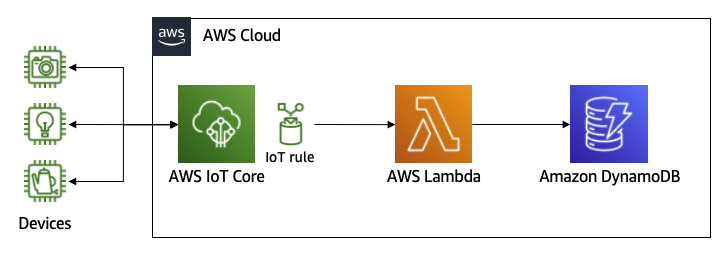

# Connectivity Management Example for AWS IoT Core build status

Simple demo application for managing the connectivity status of devices connected to AWS IoT Core. You can quickly launch a solution to store device connectivity status in Amazon DynamoDB using lifecycle events of AWS IoT Core.

- Devices connect to IoT Core using MQTT protocol.
- IoT Core publishes lifecycle events when a device connects to / disconnects from IoT Core.
- When a lifecycle event is published, an IoT rule is triggered and a Lambda function is called.
- The function checks the connectivity of the device using the lifecycle event and its previous status and updates DynamoDB.
- Applications can read the latest connectivity status of a device from DynamoDB.

## Steps

- Start LocalStack
- Install the `awslocal` CLI with `pip install awscli-local`
- Run the commands or the script `./run.sh` to create the resources in LocalStack.

## Architecture

