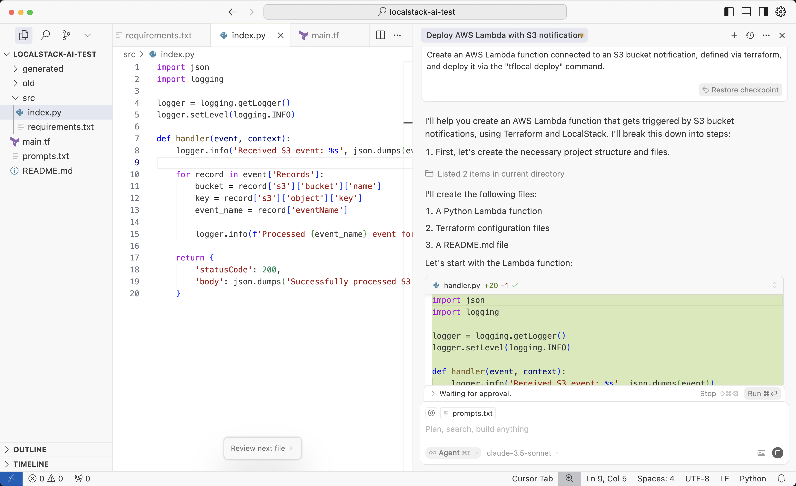

# LocalStack - Develop and test your AI-powered cloud apps locally

This repo contains supporting material for the talk at the _Open Source AI in NY_ meetup on 2025-06-11.

* Slides: https://docs.google.com/presentation/d/1lp85Gi2Btpt8h1Z7LqUpBOWu2TqZC9o_sqrXA4Ju77k

## Prerequisites

* LocalStack
* AI Coding Agent (Cursor, Claude, etc)
* Terraform/`tflocal`
* `aws` CLI

## Configure `localstack` profile for `aws` CLI

Add the following profile to your `~/.aws/config` file:
```
[profile localstack]
endpoint_url = http://localhost.localstack.cloud:4566
region_name = us-east-1
aws_access_key_id = test
aws_secret_access_key = test
```

## Configure MCP server

To run the sample in this repo, configure the following MCP server in your local AI Coding Agent (e.g., `mcp.json` config file).
```
{
  "mcpServers": {
    "aws-mcp-server": {
      "command": "docker",
      "args": [
        "run",
        "-i",
        "--rm",
        "--name=ls-aws-mcp-server",
        "--add-host=localhost.localstack.cloud:192.168.65.254",
        "-e",
        "AWS_PROFILE=localstack",
        "-v",
        "$HOME/.aws:/home/appuser/.aws:ro",
        "ghcr.io/alexei-led/aws-mcp-server"
      ]
    }
  }
}
```

Note: You may need to replace `$HOME` in the snippet above with the absolute path to your home directory.

## Auto-generate an AWS Serverless application (_Vibe Coding_)

Now we should be ready to generate an AWS sample app - for example, you could prompt your AI agent with the following request:
```
Create an AWS Lambda function connected to an S3 bucket notification, defined via Terraform, and deploy it via the "tflocal deploy" command.
```

As the code is being generated, you may have to confirm a few actions of the AI agent (e.g., create the Lambda handler, create the Terraform script, run the `tflocal apply` command, etc).

For example, if you're using [Cursor](https://cursor.com), the output may look similar to the screenshot below:


You can find a copy of the files generated by Cursor in the `generated/` directory in this repo.

## Interacting with the generated application

Once everything has been deployed, we can ask the AI to upload a file to the local S3 bucket:

```
Create a file with content "Hello from LocalStack!", and upload it to the S3 bucket
```

Once the file has been uploaded to S3, it should trigger a Lambda function, and after a few moments you should be able to see the Lambda execution output in the LocalStack logs, something like:
```
[INFO]	2025-06-11T12:28:55.661Z ... Processed ObjectCreated:Put event for s3://demo-bucket/test.txt
```

Voilà - we've just generated and deployed an AWS serverless application e2e using LocalStack, all running entirely on your local machine - with zero cloud costs, and zero risk.
